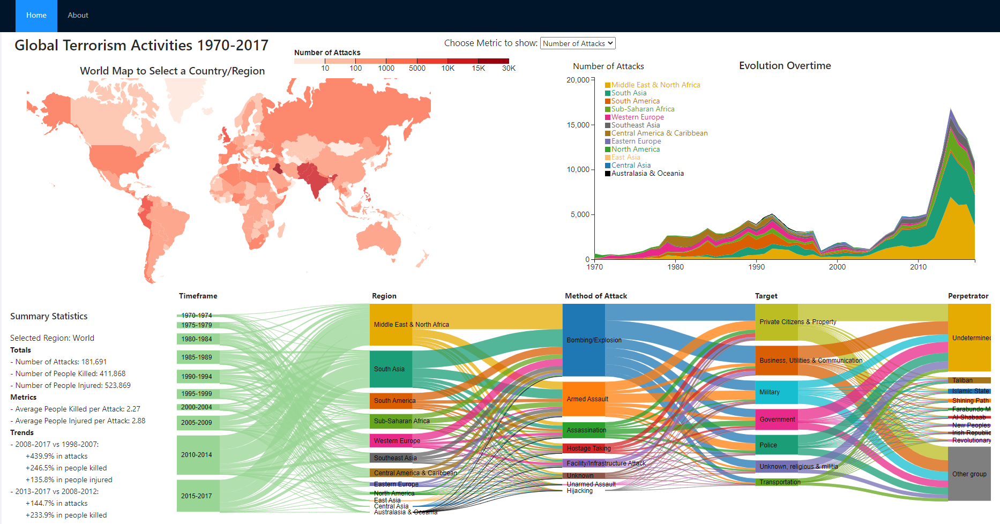

# ECS272-Final-Project
By Pablo Busch and Grant Gambetta. Fall 2022

## Instructions

The dashboard was created with an optimal resolution of 1920px x 950px. 

The aim of this project is to explore and understand the global evolution of terrorism in the last five decades (1970 to 2017). For this purpose we will use the public Global Terrorism Database (available at [Kaggle](https://www.kaggle.com/datasets/START-UMD/gtd)).

To open the visualization system, follow the steps below

1. Run `git clone https://github.com/grantgambetta/ECS272-Final-Project`
2. Run `npm i` (only the first time to install all required libraries)
3. Run `npm start`

## Expected View of the Dashboard

